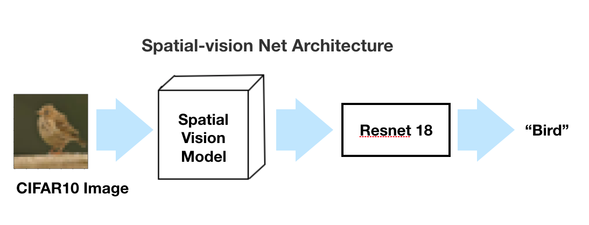
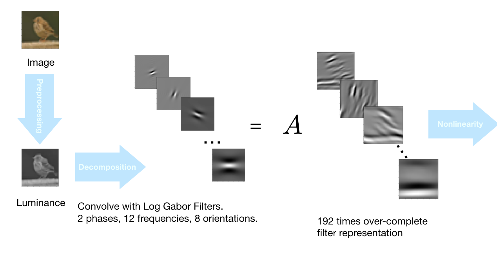
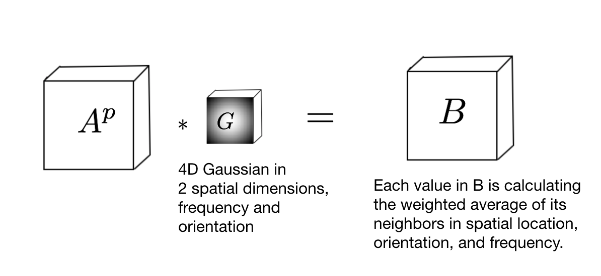
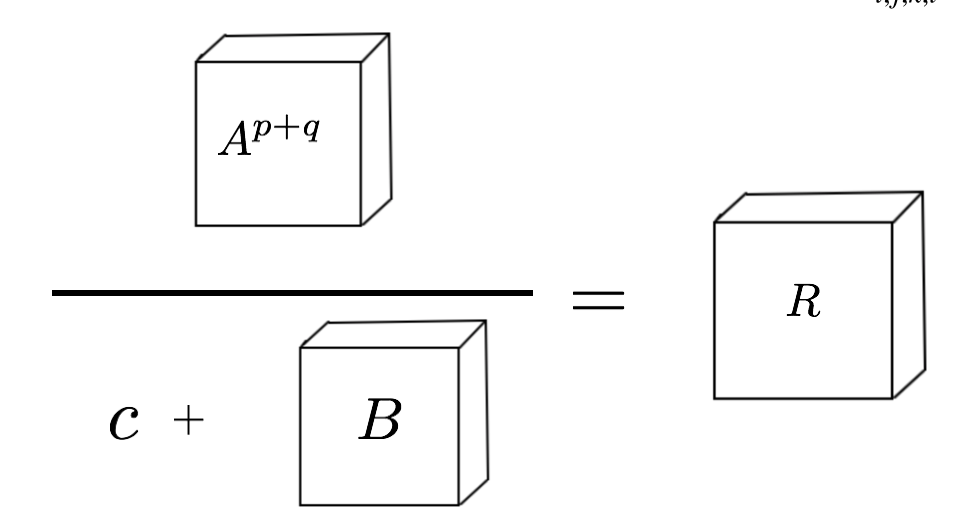

# Spatial-vision Net

## Introduction

This code package contains the code for training Spatial Vision Net and its variations trained on CIFAR10 Dataset. 

## Spatial-vision Net

Spatial Vision Net Integrates a front end of a computational spatial vision model with a backend of ResNet 18. 

Spatial-vision Net essentially contains 3 components, decomposition, normalization and nonlinearity. 

### Decomposition: 

First, the colored image is convered into luminance gray images. Then, the gray scale image is convolved with each filters from our Log-Gabor filter bank with 12 frequencies, 8 orientations, and 2 phases. In total, 192 filters are used to create 192 times over-complete representation $$A$$ of the original image.  




### Normalization:  



$$A$$ is a tensor with activities of the 192 filters applied as a result of convolution. A is passed onto one level of nonlinearity. 

The purpose of Normalization is to obtain a weighted average of each pixel with respected to its neighbors in two spatial dimensions, frequency and orientation. The weight matrix is defined as a 4 dimensional gaussian. As a result of the convolution between $A^p$ and $G$, each pixel of $B$ can be understood as a smoothified version of its corresponding pixel in $A^p$, with its value depending most strongly on the close neighbor of its corresponding pixel in $A^p$, and less strongly on far neighbor of its corresponding pixel in $A^p$.

### Nonlinearity:

Nonlinearity is a process that models the competition between neurons. For a signal to stand out, The ratio between elements of $A$ and elements of $B$ can be understood as computing how an element in a high dimensional tensor stands out compared to its weighted averaged neighbors. If this element is significantly bigger than its weighted averaged version, the ratio is going to be bigger, compared to another element which is less than its weighted averaged version. Constant $c$ is used in the denumerator to protect it against  numerical instability

$B$ is a smoothified version of $A$. 




## Run

To train a Spatial-vison Net, run: 

```shell
python3 CIFAR_normalization_training.py '' --epochs 80 --lr 0.1 -p 1000
```

## File Description: 

Training.py 

Main function call to train the networks. 

model.py

file that stores classes with respect to different types of spatial vision models. 

spatial_filters_224_by_224.mat:

spatial filters with frequency fange from 0.5 cycles per distance to 20 cycles per distance, and bandwidth from [0.5945, 0.2965]

big filters with small spatial frequency. 

TODO: the convolution filters with high frequencies have mostly blank images, it would be more efficient if the high frequency filters are smaller and the low frequency filters are bigger. But big enough too hold the bandwidth but small enough to have efficient calculations. 


Model Architecture Description: 


```
'''
all the net architecture to choose from: 

"Vanilla_ResNet": a resnet18 implemented on ImageNet
correspond to:
ImageNet_baseline_model_best.pth &
ImageNet_baseline_checkpoint.pth 

"SV_net_I: first version of spatial vision net, with Spatial vision part as front end and resnet18 as backend,
correspond to 
ImageNet_normalization_model_best.pth.tar, & 
ImageNet_normalization_checkpoint.pth.tar"

"SV_net_I_low_frequency": same thing with SV_net_I, but employing only the lower half of the frequency filters,
correspond to
ImageNet_low_freq_model_best.pth & 
ImageNet_low_freq_checkpoint.pth & 

"SV_net_II": A simplified and a more updated version of SV_net_I. The spatial vision frontend has filter responses 
separated between positive and negative, and the spatial vision backend has similar structure instead of Resnet18, for 
the purpose of overcoming the over-fitting behavior of the resnet18 backend. 
ImageNet_SV_net_II_model_best.pth.tar &
ImageNet_SV_net_II_model_checkpoint.pth.tar

"SV_net_II_low_frequency": 
A version of SV_net_II with only half of the lower frequency filters employed. 
ImageNet_SV_net_II_low_frequency_model_best.pth.tar &
ImageNet_SV_net_II_low_frequency_model_checkpoint.pth.tar

"SV_LN":
A spatial vision net that learns the normalization weights, requires collaboration with Max.
ImageNet_SV_LN_best.pth.tar &
ImageNet_SV_LN_checkpoint.pth.tar

"SV_multiple_frequencies":
A spatial vision net with frequency channels trained separately.
ImageNet_SV_MF_best.pth.tar &
ImageNet_SV_MF_checkpoint.pth.tar 
'''
```

