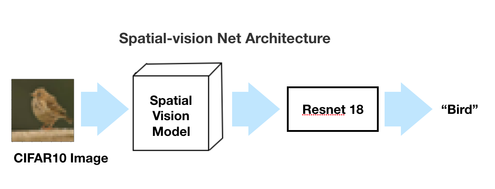

# Spatial-vision Net

## Introduction

This code package contains the code for training Spatial Vision Net and its variations trained on CIFAR10 Dataset. 

## Spatial-vision Net

Spatial Vision Net Integrates a front end of a computational spatial vision model with a backend of ResNet 18. 

 


## Run

To train a Spatial-vison Net, run: 

```shell
python3 CIFAR_normalization_training.py '' --epochs 80 --lr 0.1 -p 1000
```

